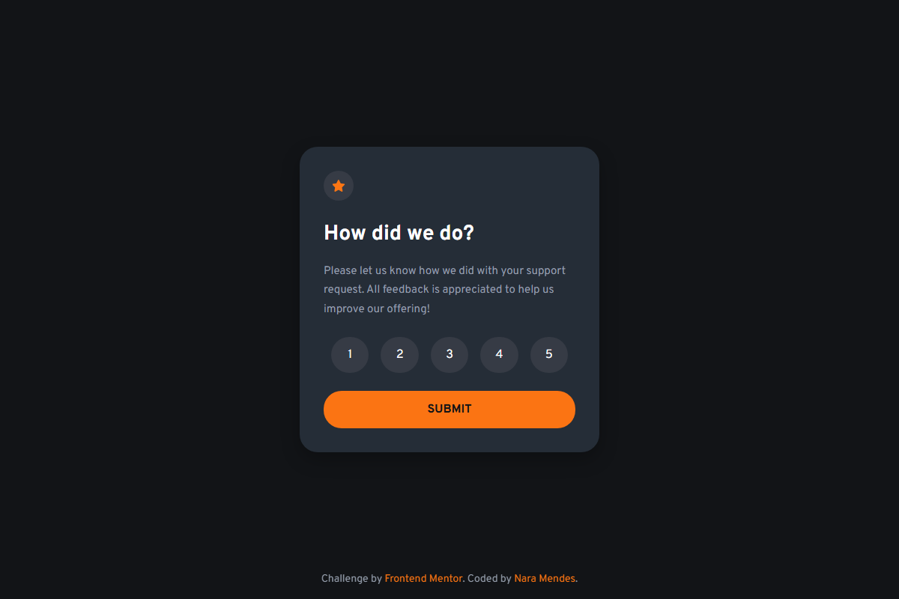

# Interactive Rating Component



*A responsive interactive rating component built with HTML, CSS, and JavaScript. This project is a solution to the Frontend Mentor challenge.*

## 🚀 Overview

This component allows users to select a rating from 1 to 5 stars and submit their feedback. After submission, a thank-you message is displayed showing the selected rating.

### Features

- **Interactive Rating Selection**: Users can select a rating from 1 to 5
- **Responsive Design**: Adapts to different screen sizes
- **Thank You State**: Displays a confirmation message after rating submission
- **Modern UI**: Clean, modern design with smooth hover and focus states
- **Accessibility**: Semantic HTML structure and keyboard navigation support

## 🛠️ Technologies Used

- **HTML5**: Semantic markup structure
- **CSS3**: Modern styling with CSS custom properties (variables), flexbox, and media queries
- **JavaScript**: Vanilla JavaScript for interactive functionality
- **Google Fonts**: Overpass font family for typography

## 📁 Project Structure

```
fm-interactive-rating-component/
├── index.html
├── README.md
├── assets/
│   ├── images/
│   │   ├── favicon-32x32.png
│   │   ├── icon-star.svg
│   │   ├── illustration-thank-you.svg
│   │   ├── screenshot.png
│   ├── scripts/
│   │   └── main.js
│   └── styles/
│       ├── reset.css
│       └── style.css
```

## 🎨 Design Highlights

- **Color Scheme**: Dark theme with orange accent color
  - Primary: `hsl(25, 97%, 53%)` (Orange)
  - Background: `hsl(216, 12%, 8%)` (Dark Blue)
  - Card Background: `hsl(213, 19%, 18%)` (Lighter Blue)
  - Text: White and `hsl(217, 12%, 63%)` (Grey)

- **Interactive States**:
  - Rating buttons highlight on hover
  - Rating buttons show white background on focus/selection
  - Submit button transitions to white on hover

## 💡 How It Works

1. User sees a rating card with a star icon and question "How did we do?"
2. Five rating buttons (1-5) are displayed for selection
3. User clicks on a rating button to select their rating
4. User clicks the "Submit" button
5. The card content is replaced with a thank-you message showing the selected rating

## 🚀 Getting Started

1. Clone the repository:
   ```bash
   git clone https://github.com/nara-md/fm-interactive-rating-component.git
   ```

2. Open `index.html` in your browser

3. No build tools or dependencies required - it's pure HTML, CSS, and JavaScript!

## 📱 Responsive Design

The component is fully responsive and adapts to mobile devices:
- On screens smaller than 600px, the rating buttons width increases to 20%
- Card padding reduces on smaller screens for better fit

## 👤 Author

**Nara Mendes**
- GitHub: [@nara-md](https://github.com/nara-md)

## 🙏 Acknowledgments

- Challenge by [Frontend Mentor](https://www.frontendmentor.io?ref=challenge)
- Coded with ❤️ by Nara Mendes

## 📄 License

This project is open source and available under the [MIT License](LICENSE).